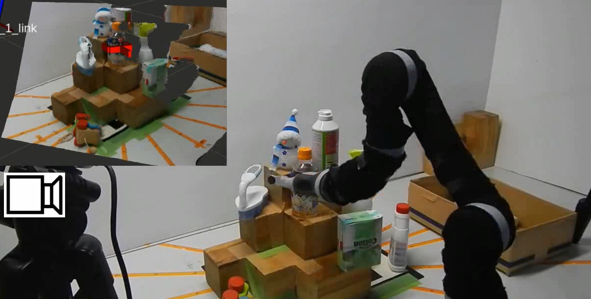
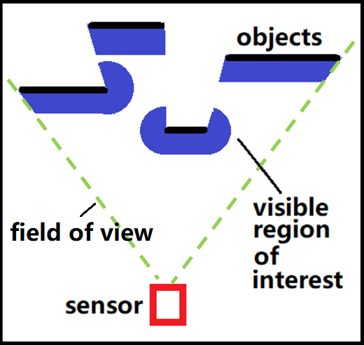
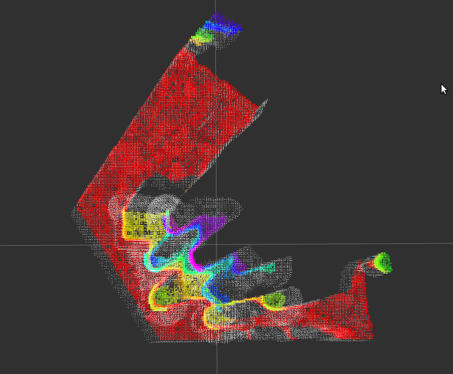
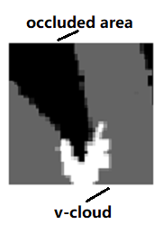

# gpd_vcloud
Remove dangerous grasp: VCloud(visible point cloud) filter implemented with "Grasp Pose Detection in Point Clouds"

* [Author's website](https://www.oit.ac.jp/elc/~matsunolab/index.html)
* [License](making)


Since the occlusion of the sensor is considered, we want to remove the partly invisible grasp from the sensor.
We provide a filter/method that includes incomplete point cloud information.
The method can be used for many different scenes such as complex backgrounds. 



To solve this problem, we introduce a novel technique named **visible point-cloud(V-cloud)** – generated using the point cloud and pose (position and orientation) information of the sensor(s) – that helps to eliminate unsafe grasp candidates quickly and efficiently.



we also define a value named **visibility** to determine the danger of grasp



Of course, the same effect can be achieved by using other filters. However, the method is more general and more efficient.

The method is implemented with "Grasp Pose Detection in Point Cloud"
* A standalone filter can be used as well for any grasp detection method ([making])

## 1) Requirements & Installation

The following instructions have been tested on  **Ubuntu 16.04**, **Ubuntu 18.04**, and  **Ubuntu 20.04**.

### 1. Install ROS. The ros installs the requirements for you.
  [PCL 1.9 or newer]
  [Eigen 3.0 or newer]
  [OpenCV 3.3 or newer]

### 2. Install gpd:
   Since we use the old version of "Grasp Pose Detection in Point Clouds". please use the **gpd** uploaded in this resp.

#### 2.1. install caffe (CPU only: it is too troublesome to install GPU version) 
   ```
    sudo apt-get install libprotobuf-dev libleveldb-dev libsnappy-dev libopencv-dev libhdf5-serial-dev protobuf-compiler
    sudo apt-get install --no-install-recommends libboost-all-dev
    sudo apt-get install libgflags-dev libgoogle-glog-dev liblmdb-dev
    sudo apt-get install libopenblas-dev liblapack-dev libatlas-base-dev

    mkdir -p ~/software/caffe
    cd ~/software/caffe
    git clone https://github.com/BVLC/caffe.git
   ```

copy the example CMake config
   ```
    cd caffe
    cp Makefile.config.example Makefile.config
   ```

change CMake config
   ```
    gedit Makefile.config
   ```
from
   ```
    CPU_ONLY := 1
    OPENCV_VERSION := 3
    INCLUDE_DIRS := $(PYTHON_INCLUDE) /usr/local/include
    LIBRARY_DIRS := $(PYTHON_LIB) /usr/local/lib /usr/lib
   ```
to
   ```
    CPU_ONLY := 1
    OPENCV_VERSION := 3
    INCLUDE_DIRS := $(PYTHON_INCLUDE) /usr/local/include /usr/include/hdf5/serial
    LIBRARY_DIRS := $(PYTHON_LIB) /usr/local/lib /usr/lib /usr/lib/x86_64-linux-gnu /usr/lib/x86_64-linux-gnu/hdf5/serial
   ```
beacuse the computing speed mkl > openlas >atlas, and caffe take atlas at default

install to the system
   ```
    mkdir ./build
    cd ./build
    cmake ..
    make all -j16
    make install -j16
    make runtest -j16
   ```


#### 2.3. install gpd
copy the gpd folder into ~/software
   ```
    mkdir build && cd build
    cmake ..
    make
    sudo make install
   ```

### 3. Build the package in ROS
copy the **gpd_vcloud** int ~catkin_ws/src.
and catkin_make/build


## 2). How to use
you need a realsense camera to obtain the point cloud
   ```
    roslaunch gpd_vcloud step1_realsense_gets_pointcloud.launch
   ```
the gpd_cloud with active once as long as point cloud exists
   ```
     roslaunch gpd_vcloud step2_gpd_vcloud.launch
   ```

## 3) References

If you like this package and use it in your own work, please cite our journal
paper. I attach the paper file in the package

Xixun Wang, S. Nisar, F. Matsuno, Robust grasp detection with incomplete point cloud and complex background.
